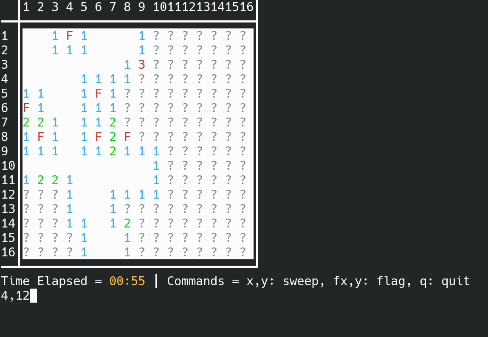

# Minesweeper CLI

This is an implementation of the classic game minesweeper using the command line as an interface.

## To run this program
```Bash
cargo run
```
or use one of the provided executables in the [releases tab](https://git.alexanderbass.com/Alexander/cli-minesweeper/releases).

## How to play

Run the program and select the size of the minefield, or press enter to go with the default.

To reveal tiles, simply type a command in the format of `x,y` such as `3,5`.
To flag tiles, prefix that command with an `f`, like `f3,5`.
To quit, use `CTRL+C` or the `q` command.

## Screenshots




This repository's home is at [https://git.alexanderbass.com/Alexander/cli-minesweeper](https://git.alexanderbass.com/Alexander/cli-minesweeper) Contributions are still welcome if you're viewing this on GitHub.
